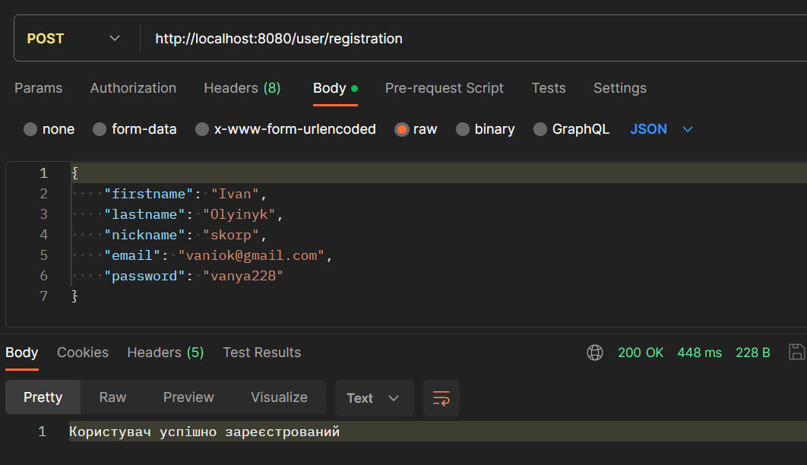
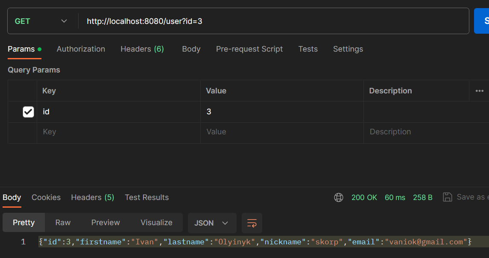
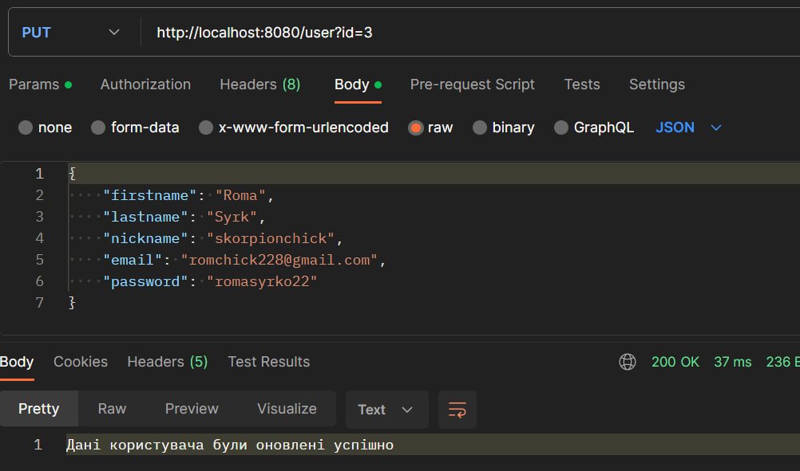
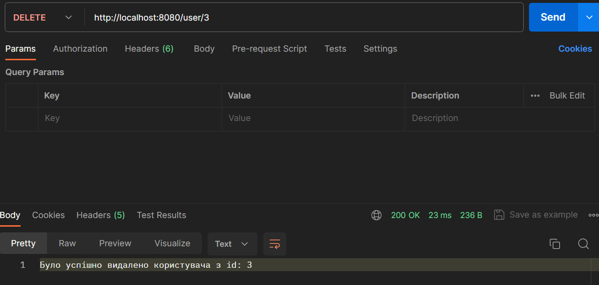

# Викоритання Java Spring Boot та PostgreSQL для реалізації CRUD REST API. Реалізація 6-ї лабораторної через Spring. 

#### Виконали студенти з групи ІМ-21:
Антоненко Тимофій [_telegram: @limon_chick7327_](https://t.me/limon_chick7327)

Фесун Анна [_telegram: @anyafesun_](https://t.me/anyafesun)

## Що таке Java Spring Boot
Spring Boot - це фреймворк на основі Java з відкритим вихідним кодом, 
розроблений компанією Pivotal Software. Завдяки швидкодії та простоті роботи 
він став популярним рішенням для створення розгортань у вигляді архіву веб-додатків 
(WAR) та автономних Java-додатків. 

Spring Boot виділяється серед інших фреймворків, оскільки він надає розробникам 
програмного забезпечення гнучке налаштування, надійну пакетну обробку, ефективний 
робочий процес та велику кількість інструментів, допомагаючи розробляти надійні та 
масштабовані програми на базі Spring.

### Головні переваги Spring Boot
Spring Boot створено, щоб допомогти програмістам прискорити процес розробки. 
Він дозволяє позбутися трудомісткої початкової установки та налаштування середовища 
розгортання. Основні переваги Spring Boot:
- Швидка та легка розробка програм на основі Spring.
- Автоконфігурація всіх компонентів для Spring виробничого рівня.
- Готові вбудовані сервери (Tomcat, Jetty та Undertow), що забезпечують прискорене 
та більш продуктивне розгортання додатків.
- HTTP end-points, що дозволяють вводити внутрішні функції програми, такі як 
показники, стан здоров'я та інші.
- Відсутність конфігурації XML.
- Величезний вибір плагінів, що полегшують роботу розробників із вбудованими 
базами даних та базами даних у пам'яті.
- Легкий доступ до баз даних та служб черг, таких як MySQL, Oracle, MongoDB, 
Redis, ActiveMQ та інших.
- Плавна інтеграція із екосистемою Spring.
- Велика спільнота і безліч навчальних програм, що полегшують період ознайомлення.

### Головні недоліки Spring Boot
- Відсутність контролю. Spring Boot створює безліч залежностей, що не використовуються, 
що призводить до великого розміру файлу розгортання.
- Складний і трудомісткий процес перетворення застарілого чи існуючого проекту Spring 
на програми Spring Boot.
- Не підходить для масштабних проектів. На думку багатьох розробників, незважаючи 
на відсутність проблем під час роботи з мікросервісами, Spring Boot не підходить для 
створення монолітних програм.

## Що таке PostgreSQL
PostgreSQL — об'єктно-реляційна система управління базами даних (СУБД). 
Є альтернативою як комерційним СУБД (Oracle Database, Microsoft SQL Server, IBM DB2 та 
іншим), так і СУБД з відкритим кодом (MySQL, Firebird, SQLite).

Порівняно з іншими проєктами з відкритим кодом, такими як Apache, FreeBSD або MySQL, 
PostgreSQL не контролюється якоюсь однією компанією, її розробка можлива завдяки 
співпраці багатьох людей та компаній, які хочуть використовувати цю СУБД та 
впроваджувати у неї найновіші досягнення.

Сервер PostgreSQL написаний на мові C. Зазвичай розповсюджується у вигляді набору 
текстових файлів із початковим кодом. Для інсталяції необхідно відкомпілювати файли 
на своєму комп'ютері і скопіювати в деякий каталог. Весь процес детально описаний в 
документації.

### Основні переваги PostgreSQL
- PostgreSQL має ліцензію PostgreSQL, яка є вільною та відкритою. Це означає, 
що ви можете вільно користуватися, модифікувати та розповсюджувати код.
- PostgreSQL підтримує розширені можливості, такі як географічна інформаційна система 
(GIS), та має велику кількість додаткових модулів та розширень.
- PostgreSQL сильно дотримується стандартів мови SQL, що робить його сумісним з 
багатьма іншими СУБД та дозволяє легше переносити код.
- PostgreSQL відомий своєю високою стійкістю та надійністю. Він може обробляти великі 
об'єми даних та має механізми відміни транзакцій.
- PostgreSQL підтримує горизонтальне та вертикальне масштабування, що дозволяє 
пристосовувати базу даних до зростання обсягів даних.
- Є велика активна спільнота користувачів PostgreSQL, яка допомагає вирішувати 
проблеми та розробляти нові можливості.

### Основні недоліки PostgreSQL
- Для ефективного управління PostgreSQL потрібен досвідчений адміністратор баз даних, 
оскільки вона має складні конфігураційні опції.
- PostgreSQL може вимагати більше ресурсів порівняно з іншими легковаговими СУБД, 
особливо при роботі з великими обсягами даних.
- У порівнянні з деякими популярними комерційними СУБД, PostgreSQL може мати менший 
ринок застосування в деяких сегментах.
- Графічний інтерфейс для управління PostgreSQL може бути менш зручним або менше 
інтуїтивно зрозумілим у порівнянні з іншими системами.
- У деяких випадках швидкість операцій у PostgreSQL може бути трошки меншою, ніж 
у деяких інших СУБД, особливо при неоптимізованих запитах.

## Початок роботи
Для початку розробки REST API за допомогою Java Spring Boot та PostgreSQL необхідно 
встановити PostgreSQL з офіційного сайту та створити Spring Application в IntelliJ IDEA. 
Також потрібно встановити Postman для тестування працездатності застосунку.

Ми розглянемо створення простого RESTfull сервіса з використанням патерну MVC 
із реалізацією CRUD операцій та PostgreSQL як сховищем даних. 

Для початку необхідно створити таблицю в базі даних:

```sql
    CREATE TABLE "User" (
        id BIGINT PRIMARY KEY NOT NULL,
        firstname VARCHAR(25) NOT NULL,
        lastname VARCHAR(25) NOT NULL,
        nickname VARCHAR(25) NOT NULL UNIQUE,
        email VARCHAR(65) NOT NULL UNIQUE,
        password VARCHAR(25) NOT NULL
    );
```

### Реалізація Controller
```
    package com.example.db_project.controller;
    
    import com.example.db_project.entity.UserEntity;
    import com.example.db_project.exception.EmailAlreadyExistException;
    import com.example.db_project.exception.NicknameAlreadyExistException;
    import com.example.db_project.exception.UserNotFoundException;
    import com.example.db_project.service.UserService;
    import org.springframework.beans.factory.annotation.Autowired;
    import org.springframework.http.ResponseEntity;
    import org.springframework.web.bind.annotation.*;
    
    @RestController
    @RequestMapping("/user")
    public class UserController {
        @Autowired
        private UserService userService;
    
        @PostMapping("/registration")
        public ResponseEntity registration(@RequestBody UserEntity user){
            try {
                userService.registrationUser(user);
                return ResponseEntity.ok("Користувач успішно зареєстрований");
            } catch (EmailAlreadyExistException | NicknameAlreadyExistException exception){
                return ResponseEntity.badRequest().body(exception.getMessage());
            } catch (Exception exception){
                return ResponseEntity.badRequest().body("Відбулась помилка");
            }
        }
    
        @GetMapping
        public ResponseEntity getUser(@RequestParam Long id){
            try {
                return ResponseEntity.ok(userService.getUser(id));
            } catch (UserNotFoundException exception){
                return ResponseEntity.badRequest().body(exception.getMessage());
            } catch (Exception exception){
                return ResponseEntity.badRequest().body("Відбулась помилка");
            }
        }
    
        @DeleteMapping("/{id}")
        public ResponseEntity deleteUser(@PathVariable Long id){
            try {
                return ResponseEntity.ok("Було успішно видалено користувача з id: " +
                        userService.deleteUser(id));
            } catch (UserNotFoundException exception){
                return ResponseEntity.badRequest().body(exception.getMessage());
            } catch (Exception exception){
                return ResponseEntity.badRequest().body("Відбулась помилка");
            }
        }
    
        @PutMapping
        public ResponseEntity updateSurvey(@RequestParam Long id,
                                           @RequestBody UserEntity user){
            try {
                userService.updateSurvey(id, user);
                return ResponseEntity.ok("Дані користувача були оновлені успішно");
            }catch (UserNotFoundException | EmailAlreadyExistException |
                    NicknameAlreadyExistException exception) {
                return ResponseEntity.badRequest().body(exception.getMessage());
            } catch (Exception exception){
                return ResponseEntity.badRequest().body("Відбулась помилка");
            }
        }
    }
```

### Реалізація Entity

```
    package com.example.db_project.entity;

    import jakarta.persistence.*;
    
    @Entity
    @Table(name = "\"user\"")
    public class UserEntity {
    
        @Id
        @GeneratedValue(strategy = GenerationType.IDENTITY)
        private Long id;
        private String firstname;
        private String lastname;
        private String nickname;
        private String email;
        private String password;
    
        public UserEntity() {
        }
    
        public Long getId() {
            return id;
        }
    
        public void setId(Long id) {
            this.id = id;
        }
    
        public String getFirstname() {
            return firstname;
        }
    
        public void setFirstname(String firstname) {
            this.firstname = firstname;
        }
    
        public String getLastname() {
            return lastname;
        }
    
        public void setLastname(String lastname) {
            this.lastname = lastname;
        }
    
        public String getNickname() {
            return nickname;
        }
    
        public void setNickname(String nickname) {
            this.nickname = nickname;
        }
    
        public String getEmail() {
            return email;
        }
    
        public void setEmail(String email) {
            this.email = email;
        }
    
        public String getPassword() {
            return password;
        }
    
        public void setPassword(String password) {
            this.password = password;
        }
    }
```

### Реалізація Service

```
    package com.example.db_project.service;
    
    import com.example.db_project.entity.UserEntity;
    import com.example.db_project.exception.EmailAlreadyExistException;
    import com.example.db_project.exception.NicknameAlreadyExistException;
    import com.example.db_project.exception.UserNotFoundException;
    import com.example.db_project.model.User;
    import com.example.db_project.repository.UserRepo;
    import org.springframework.beans.factory.annotation.Autowired;
    import org.springframework.stereotype.Service;
    
    @Service
    public class UserService {
    
        @Autowired
        private UserRepo userRepo;
    
        public UserEntity registrationUser(UserEntity user) throws EmailAlreadyExistException, NicknameAlreadyExistException {
            if (userRepo.findByEmail(user.getEmail()) != null){
                throw new EmailAlreadyExistException("Користувач з такою електронною поштою вже існує");
            } else if (userRepo.findByNickname(user.getNickname()) != null) {
                throw new NicknameAlreadyExistException("Користувач з таким нікнеймом вже існує");
            }
            return userRepo.save(user);
        }
    
        public User getUser(Long id) throws UserNotFoundException {
            UserEntity userEntity = userRepo.findById(id).get();
            if (userEntity == null){
                throw new UserNotFoundException("Такого користувача не найдено");
            }
            return User.toModel(userEntity);
        }
    
        public Long deleteUser(Long id) throws UserNotFoundException {
            if (userRepo.findById(id) == null){
                throw new UserNotFoundException("Такого користувача вже не існує");
            }
            userRepo.deleteById(id);
            return id;
        }
        public UserEntity updateSurvey(Long id, UserEntity user)
                throws EmailAlreadyExistException, NicknameAlreadyExistException,
                UserNotFoundException {
            UserEntity userEntity = userRepo.findById(id).get();
            if(userEntity == null){
                throw new UserNotFoundException("Такого користувача не існує");
            }
            userEntity.setFirstname(user.getFirstname());
            userEntity.setLastname(user.getLastname());
            userEntity.setEmail(user.getEmail());
            userEntity.setNickname(user.getNickname());
            if(userRepo.findByNickname(userEntity.getNickname()) != null){
                throw new NicknameAlreadyExistException("Користувач з таким нікнеймом вже існує");
            } else if (userRepo.findByEmail(userEntity.getEmail()) != null){
                throw new EmailAlreadyExistException("Користувач з такою електронною поштою вже існує");
            }
            return userRepo.save(userEntity);
        }
    }
```

### Реалізація Model

```
    package com.example.db_project.model;
    
    import com.example.db_project.entity.UserEntity;
    
    public class User {
        private Long id;
        private String firstname;
        private String lastname;
        private String nickname;
        private String email;
    
        public static User toModel(UserEntity entity){
            User model = new User();
            model.setId(entity.getId());
            model.setFirstname(entity.getFirstname());
            model.setLastname(entity.getLastname());
            model.setNickname(entity.getNickname());
            model.setEmail(entity.getEmail());
            return model;
        }
    
        public User() {
        }
    
        public Long getId() {
            return id;
        }
    
        public void setId(Long id) {
            this.id = id;
        }
    
        public String getFirstname() {
            return firstname;
        }
    
        public void setFirstname(String firstname) {
            this.firstname = firstname;
        }
    
        public String getLastname() {
            return lastname;
        }
    
        public void setLastname(String lastname) {
            this.lastname = lastname;
        }
    
        public String getNickname() {
            return nickname;
        }
    
        public void setNickname(String nickname) {
            this.nickname = nickname;
        }
    
        public String getEmail() {
            return email;
        }
    
        public void setEmail(String email) {
            this.email = email;
        }
    }
```

### Реалізація Repository

```
    package com.example.db_project.repository;

    import com.example.db_project.entity.UserEntity;
    import org.springframework.data.repository.CrudRepository;
    
    public interface UserRepo extends CrudRepository<UserEntity, Long> {
        UserEntity findByNickname(String nickname);
        UserEntity findByEmail(String email);
    }
```

## Тестування

### Внесення даних


### Отримання даних


### Зміна даних


### Видалення даних


## Висновки

Ми реалізували CRUD API для таблиці User за допомогою Java Spring Boot 
та PostgreSQL з використанням патерну MVC. Розглянули способи реалізації цього АРІ та 
перевірили його працездатність.

### Корисні джерела
- [Повний курс Spring](https://youtu.be/q87Xxu4NPIc?si=jpzjLF4mjB0eNBxc)
- [Spring Guides](https://spring.io/guides/)
- [Документація PostgreSQL](https://www.postgresql.org/files/documentation/pdf/16/postgresql-16-A4.pdf)